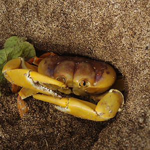

# Current Research and Conservation Projects
I am also collaborator in the following research and/or conservation projects:

#Lateral subsidies from aquatic to terrestrial environments mediated by vertebrates
 
Similarities and contrasts between marine and estuarine islands:
Marine megafauna is responsible for the movement of a considerable amount of energy and matter between the ecosystem compartments, in the form of nutrients and pollutants, in different spatial and temporal scales. This project aims to determine the routes and quantify the lateral subsidies in island environments. Those results are important for local communities, integrating their economical activities with conservation strategies, promoting environmental education and citizen science.

RETER-TRINDADE: Recovery of the Terrestrial Ecosystem of the Island of Trindade, avoiding the extinction of endangered species:
Trindade Island is a unique insular environment, considered a biodiversity hotspot in the southwestern Atlantic Ocean. However, the introduction of invasive species, as well as fires that have occurred in recent centuries, have compromised the island's terrestrial ecosystem. With the destruction of trees, endangered seabirds such as the Sula sula, extinct locally, and the critically endangered (CR) Fregata trinitatis and Fregata minor nicolli, which used arboreal vegetation for nesting, are no longer seen reproducing in the area for decades. The program brings a unique opportunity to recover the island's natural conditions existing before human colonization. The potential results involve the conservation and recovery of this singular environment and the last effort for the conservation of almost extinct frigate birds.

Monitoring of the Ornithofauna of the Port of Rio Grande:
Habitat alteration and the establishment of activities with a high risk of contamination must be monitored. However, some species may be beneficiaries of human activities found in industrial and urban spaces that offer easy access to food and shelter. This project aims to quantify and qualify ornithofauna activities, focusing on synanthropic species in the areas of activity of the Port of Rio Grande and its surroundings. This project provides information about the Port of Rio Grande activities’ impacts on the ornithofauna, used by environmental authorities for activities regulation, and for the port administration for mitigation measures.

Long-term studies to assess natural and anthropic impacts in the Lagoa dos Patos estuary and adjacent marine coast:
The Lagoa dos Patos estuary (ELPA) and the adjacent marine coast are sites of importance for resident and migratory fauna, being an area of high biological productivity and ecological complexity. Industrial activities and urbanization may cause environmental harm, requiring historical series monitoring of factors that influence the hydrology and ecological dynamics of the ELPA. This project consists of long term monitoring of the biotic and abiotic factors that influence the ecological dynamics of the ELPA. The results are important for local communities, integrating their economical activities with conservation strategies, promoting environmental education, and citizen science.

Waterbirds in Rio Grande do Sul: distribution, ecology and conservation:
Waterbirds of Rio Grande do Sul state have been poorly studied. This project aims to expand the knowledge of the different species of waterbirds, studying aspects of reproductive biology and feeding strategies, determining the use of habitats, and the connectivity between environments. All the information is made publicly available for communities and academia, as well as environmental authorities, being used to develop conservation strategies such as the National Plans for Environmental Conservation. Besides, the carcasses of birds found dead are deposited in the Birds Collection of Universidade Federal do Rio Grande (CAFURG).
